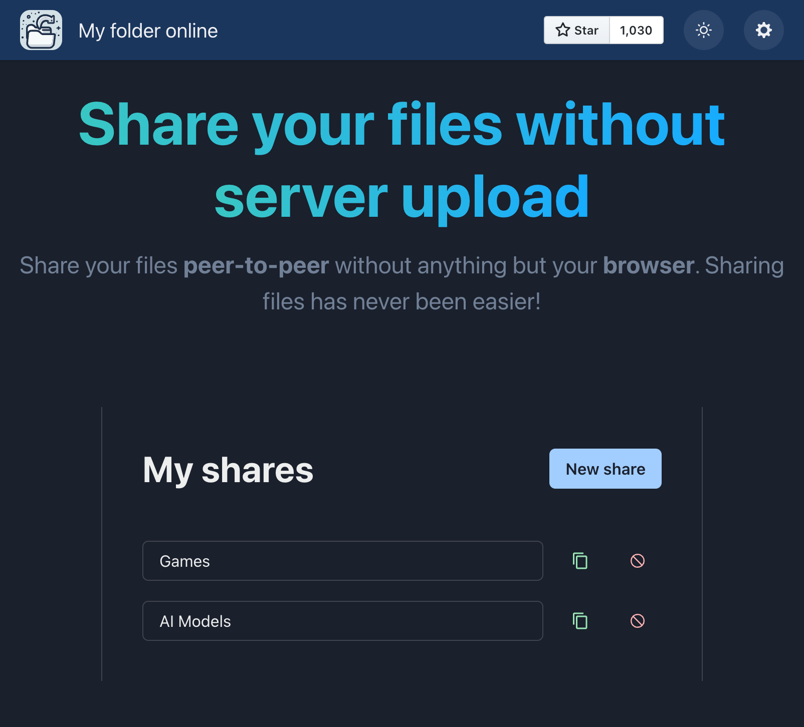
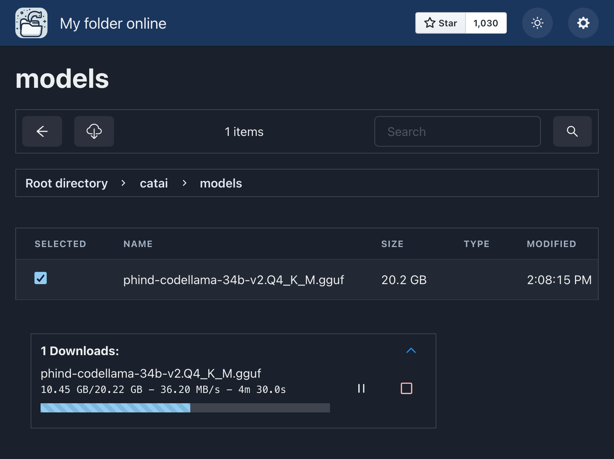
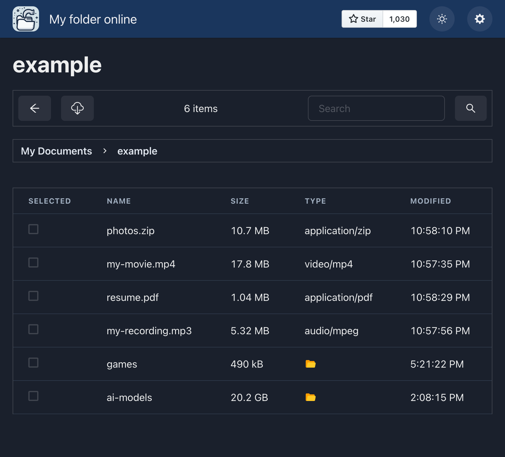

  

# My Folder Online WebApp 🚀

> Simple webapp to share files online **peer-to-peer**.

## Features

- Peer-to-peer sharing (for privacy) 🫣
- High speed (using WebRTC) ⚡️
- Directory sharing (share a whole directory) 📁
- PWA (installable webapp) 📱
- Cross-platform (works on any device) 🖥️
- FileSystem API (no zip files needed for directory download) 🗂️

## Screenshots

## Why MyFolderOnline is Cool?

### Enhanced Privacy and Security 🔒

MyFolderOnline ensures that your data is transmitted directly between users, eliminating the need for a central server.
This approach enhances privacy and security, keeping your shared files confidential and protected.

### Efficient and Seamless User Experience ⚙️

Leveraging WebRTC technology, MyFolderOnline facilitates lightning-fast file transfers, enabling hassle-free sharing of
large files and directories. Say goodbye to tedious upload/download processes and enjoy a seamless sharing experience.

### Versatile and Accessible Across Devices 🌐

MyFolderOnline works flawlessly across various devices and operating systems, allowing you to share files from anywhere,
be it your laptop, desktop, or mobile device.

## How to Contribute

Contributions are welcome! If you want to improve My-Folder-Online, follow these steps:

1. Fork this repository.
2. Create a new branch.
3. Make your changes and commit them (please follow the [commit message guidelines](./CONTRIBUTING.md))
4. Push your changes to the branch.
5. Open a pull request.

    
     
    

        <i>If you like this repo, star it ✨</i>&nbsp;&nbsp;&nbsp;&nbsp;&nbsp;&nbsp;&nbsp;&nbsp;&nbsp;&nbsp;&nbsp;&nbsp;&nbsp;&nbsp;&nbsp;&nbsp;&nbsp;&nbsp;&nbsp;&nbsp;&nbsp;&nbsp;&nbsp;&nbsp;&nbsp;&nbsp;&nbsp;&nbsp;&nbsp;&nbsp;&nbsp;&nbsp;&nbsp;&nbsp;&nbsp;&nbsp;&nbsp;&nbsp;&nbsp;&nbsp;&nbsp;&nbsp;&nbsp;&nbsp;&nbsp;&nbsp;&nbsp;&nbsp;&nbsp;&nbsp;&nbsp;&nbsp;
    

